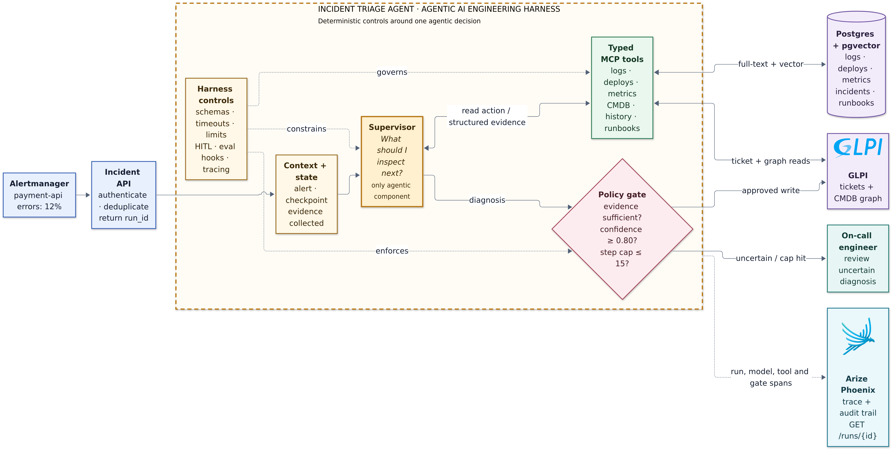

# Incident Triage Agent — Technical Architecture

## Purpose

The system investigates production incidents. Given an alert on a downstream
service, it follows runtime evidence through logs, deployments, dependencies,
past incidents, and runbooks to identify the likely root cause. It writes only
through a policy and approval gate; uncertain cases go to the on-call engineer.

## The 90-second explanation

1. Alertmanager sends an authenticated incident webhook.
2. The API deduplicates the alert and creates a stable `run_id`.
3. One supervisor makes the only agentic decision: **what evidence should I
   inspect next?**
4. Typed MCP tools read bounded evidence from operational systems.
5. A deterministic gate checks evidence, confidence, and the 15-step limit.
6. Supported diagnoses can update GLPI; uncertain cases require human review.
   Phoenix retains the model, tool, gate, and write trace.

The design rule is: **the model chooses where to look next; code owns access,
limits, write policy, and auditability.**

## Production shape

| Component | Responsibility |
|---|---|
| Alertmanager | Detect a production symptom and deliver the alert |
| FastAPI | Authenticate, deduplicate, create runs, and expose audit/approval APIs |
| LangGraph supervisor | Select the next evidence-gathering action |
| MCP tools | Provide typed reads for logs, metrics, deploys, CMDB, incidents, and runbooks |
| Postgres + pgvector | Exact operational queries plus semantic incident/runbook retrieval |
| GLPI | Ticket and CMDB system of record |
| Policy gate | Enforce confidence, evidence, step-cap, and approval rules |
| On-call engineer | Review uncertain diagnoses and approve consequential writes |
| OpenTelemetry + Phoenix | Preserve the reconstructable decision trail |

The production target adds a durable work queue and run ledger so webhook
handling is fast, retries are idempotent, and workers resume from checkpoints.

## Request lifecycle

1. `POST /webhooks/incident` validates the webhook and reserves an alert
   fingerprint.
2. A duplicate returns the existing `run_id`; a new alert creates a queued run.
3. A worker loads the checkpoint and starts the supervisor.
4. The supervisor calls one typed read tool at a time and records the evidence.
5. The loop ends with a diagnosis or after the hard 15-step cap.
6. The policy gate either permits a controlled write or requires review.
7. Approved writes use an idempotency key tied to run, ticket, and action.
8. `GET /runs/{id}` reconstructs the evidence and decision trail.

## Data and retrieval choices

| Data | Retrieval | Why |
|---|---|---|
| Logs | Service- and time-bounded Postgres full-text search | Identity and time are part of correctness |
| Metrics and deployments | Relational queries | Deterministic filters and aggregation |
| Past incidents | pgvector similarity | Equivalent failures use different wording |
| Runbooks | pgvector similarity | Symptom and remediation language rarely match exactly |
| Service dependencies | GLPI CMDB graph traversal | Direction and topology matter |

Logs are deliberately not embedded. A similar error from the wrong service or
time window is not evidence for the current incident.

## Safety and evaluation

- Read and write interfaces are separate; writes require an approval capability.
- Tool arguments use typed schemas, bounded time windows, and result limits.
- Operational text is treated as untrusted evidence, never as authority.
- Low confidence, incomplete evidence, or a cap hit always escalates.
- Every decision and tool call is linked to `run_id`.
- Evaluation checks root cause, tool efficiency, false alarms, and whether each
  service was discovered from prior evidence rather than guessed.

## Open-source stack

| Layer | Technology |
|---|---|
| API and contracts | FastAPI, Pydantic |
| Agent runtime | LangGraph, one bounded supervisor |
| Tool boundary | Model Context Protocol (MCP) |
| Operational data | PostgreSQL, pgvector |
| ITSM and CMDB | GLPI with MySQL |
| Tracing and audit | OpenTelemetry, Arize Phoenix |
| Local infrastructure | Docker Compose |

## Current status

| Area | Status |
|---|---|
| GLPI, MySQL, Postgres/pgvector, and Phoenix infrastructure | Implemented |
| Seeded topology, synthetic incident corpus, and 30 golden cases | Implemented |
| Two MCP servers and 11 typed tools | Implemented |
| Single supervisor, hard cap, checkpointing, and confidence gate | Implemented |
| Human-review interrupt and guarded ticket writes | Implemented |
| OpenTelemetry attributes and `GET /runs/{id}` audit reconstruction | Implemented |
| Webhook, durable queue, idempotency, and approval API | Next phase |
| Automated evaluation, chaos suite, CI, and deployment | Planned |

The current suite has 106 passing tests. The architecture is intentionally
bounded: one agentic decision path, deterministic integrations, and explicit
human authority over uncertain or consequential actions.
