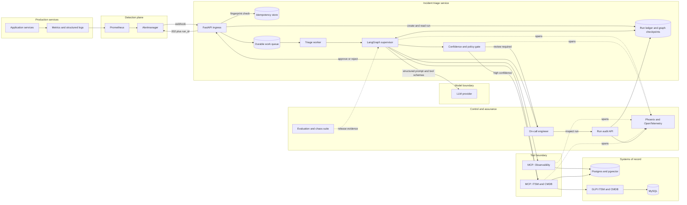
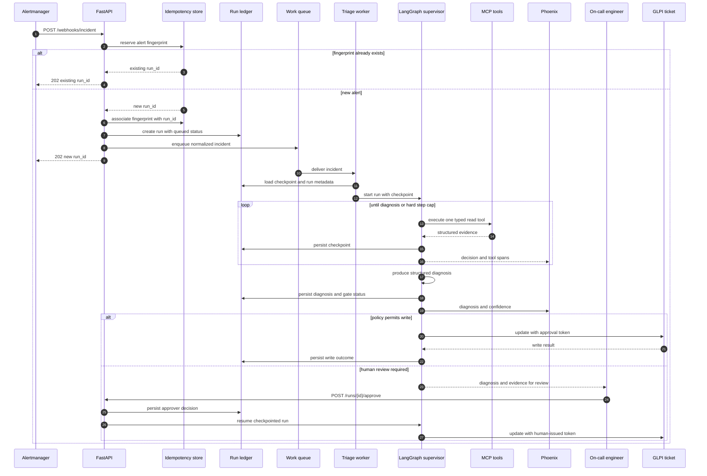
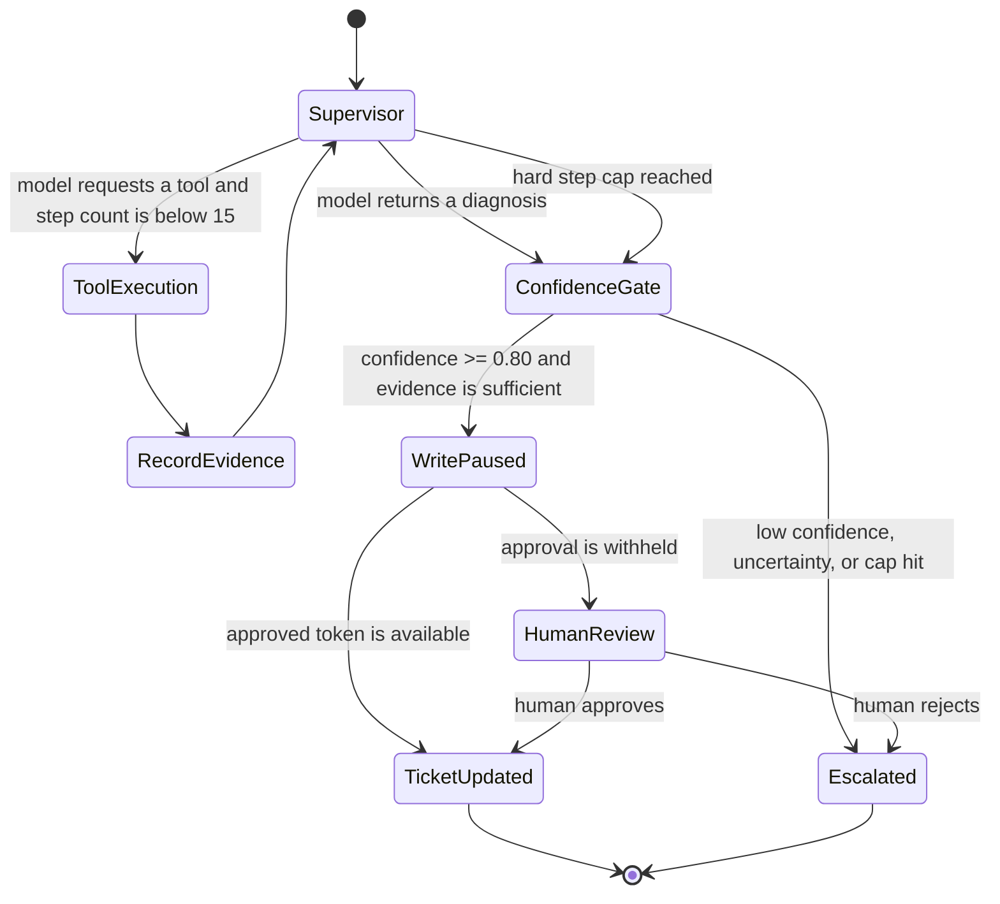
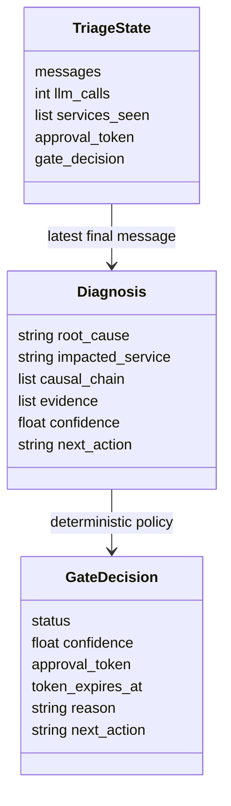
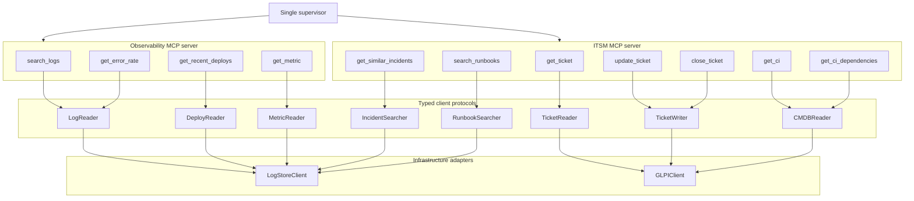
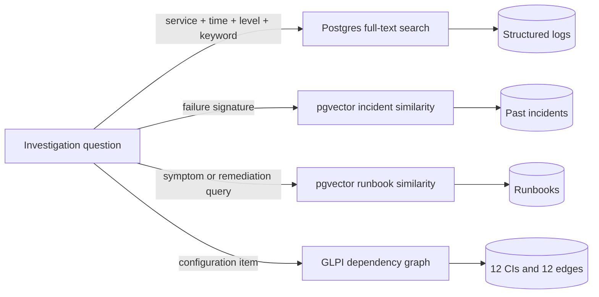
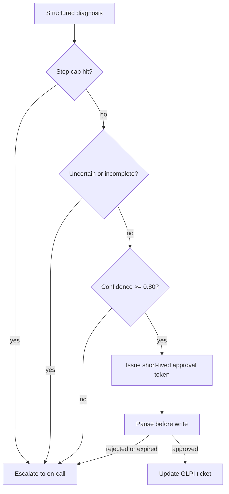
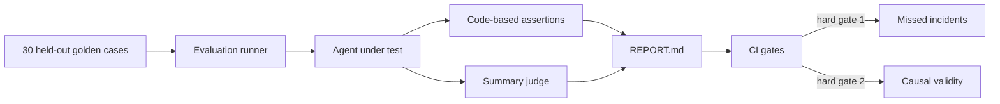
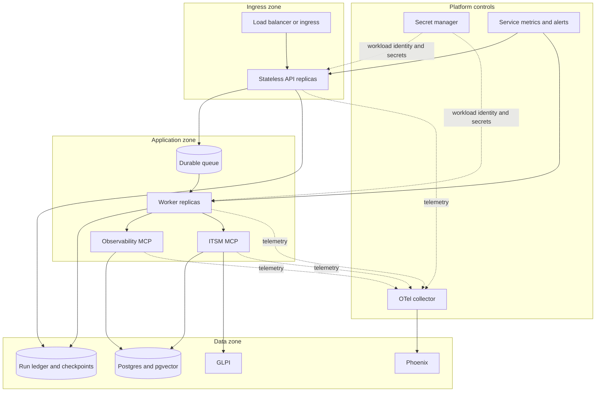

# Incident Triage Agent — Technical Architecture

## Purpose

This system investigates production incidents. It does not remediate them.
Given an alert on a service, it gathers evidence, follows service dependencies,
identifies a likely root cause, and either writes a diagnosis to the incident
ticket or escalates for human review.

The expensive part of incident response is often not applying the fix. It is
finding the failing component when the alert fires on a downstream victim.

## Status legend

- **Implemented** — present in the repository and covered by tests.
- **In progress** — partially implemented.
- **Target** — production architecture, not yet implemented.

The diagrams describe the production target. The delivery-status table at the
end states what exists today.

## The 90-second explanation


The dotted boundary is the **agentic engineering harness**. It is not another
agent. It is the deterministic software around the model: context and state,
typed tools, schemas, limits, human approval, evaluation hooks, and tracing.

1. An alert arrives for a visible symptom, such as a high error rate on
   `payment-api`.
2. The API deduplicates the alert and assigns a stable run ID.
3. One supervisor makes the only agentic decision: what evidence to inspect
   next. It uses typed MCP tools and cannot exceed 15 steps.
4. The tools read logs, deploys, service dependencies, past incidents, and
   runbooks. Their structured results determine the supervisor's next step.
5. A deterministic policy gate checks whether the diagnosis has enough evidence
   and confidence.
6. Supported diagnoses can update the ticket; uncertain runs go to an engineer.
   Every decision and tool call is retained in the audit trail.

The sentence to remember is: **the model chooses where to look next; code owns
data access, limits, write policy, and auditability.**

## 1. Production system context



### Responsibility boundaries

| Component | Responsibility | Must not do |
|---|---|---|
| Alertmanager | Detect and deliver an alert | Diagnose the incident |
| FastAPI ingress | Validate, deduplicate, return a run ID | Perform investigation on the request thread |
| Work queue | Buffer and redeliver work | Decide investigation steps |
| Run ledger | Persist lifecycle state, checkpoints, approvals, and write outcomes | Replace detailed traces |
| Supervisor | Select the next evidence-gathering action | Directly access databases or bypass policy |
| LLM provider | Return the next structured decision or diagnosis | Receive unredacted secrets or own workflow state |
| MCP servers | Expose typed operational capabilities | Decide the root cause |
| Confidence gate | Enforce write and escalation policy | Infer missing evidence |
| GLPI | Remain the incident and CMDB system of record | Run agent logic |
| Phoenix | Persist traces and support audits | Become the business state store |
| Evaluation suite | Measure correctness and causal validity | Tune against the held-out set during a run |

The durable queue and separate worker are production hardening. The current
repository has the synchronous graph and read-only audit endpoint; API-triggered
background execution is the next delivery phase.

## 2. Request and run lifecycle



### Delivery semantics

- The webhook returns `202 Accepted` with a stable `run_id`; investigation does
  not block Alertmanager.
- The alert fingerprint is the idempotency key. Redelivery returns the existing
  run rather than starting a second investigation.
- Queue delivery is at least once. Tool reads are naturally repeatable; writes
  must be idempotent and gated by a short-lived approval token.
- The graph checkpoint is the recovery point. A worker restart must not restart
  the reasoning loop from step zero or duplicate a ticket write.
- `GET /runs/{id}` is the operational read model. In the production target,
  lifecycle state comes from the run ledger and detailed reasoning comes from
  Phoenix. The current implementation reconstructs the response from Phoenix.

## 3. The agentic boundary

Only one part of the system is agentic: choosing the next investigation step.



Everything around that decision is deterministic:

- fetching a ticket;
- searching a bounded log window;
- calculating an error rate;
- reading the CMDB graph;
- retrieving similar incidents;
- issuing or rejecting an approval token;
- updating a ticket;
- recording traces and audit data.

This is deliberately a single-supervisor design. Tool specialization belongs
in typed interfaces, not in a group of agents negotiating with one another.
For an auditable incident workflow, one decision path is easier to test,
reconstruct, and govern.

## 4. Agent state and invariants



The runtime invariants are enforced in code:

1. **Hard loop bound:** the conditional graph edge routes to the gate after 15
   model calls. This is not a prompt instruction.
2. **Checkpoint required:** the graph cannot compile without a checkpointer.
3. **Write isolation:** read protocols and write protocols are separate.
4. **Approval required:** ticket writes reject an absent approval token.
5. **Uncertainty escalates:** low confidence, incomplete evidence, a manual-review
   action, or a cap hit cannot silently become an automatic write.
6. **Causal trail retained:** `services_seen` supports evaluation of whether a
   service was discovered from evidence rather than guessed.

## 5. Tool and integration architecture



The supervisor depends on a tool registry rather than concrete database or
GLPI clients. Replacing GLPI with ServiceNow should change the ITSM adapter,
not the graph, gate, or evaluation contract.

## 6. Data and retrieval architecture



| Data | Retrieval | Reason |
|---|---|---|
| Logs | Exact, service-scoped, time-bounded full-text search | Time and identity are part of correctness |
| Deploys and error rates | Relational queries | Deterministic aggregation and filtering |
| Past incidents | Vector similarity | Equivalent failures may use different wording |
| Runbooks | Vector similarity | Symptoms and remediation language rarely match exactly |
| Service dependencies | CMDB graph traversal | Dependency direction matters; similarity does not |

Logs are intentionally not embedded. A semantically similar error from the
wrong service or the wrong hour is not evidence for the current incident.

Current development data includes 19,654 synthetic log lines across seven
causal failure patterns. The synthetic choice is explicit: a sampled Loghub
HDFS dataset contained no error lines and did not represent this problem
domain. Correct causal structure is more useful here than unrelated real data.

## 7. Governance and write safety



The governance path is expressed in code rather than left to prompt wording:

- read tools never require a token;
- write tools require a token in their typed signature;
- the gate creates the automatic token and records an intended expiry;
- LangGraph interrupts before the write node;
- the API exposes approval state but never returns the token itself.

The current writer validates that a token is present; it does not yet validate
provenance, scope, expiry, or reuse. For production, the token must be signed or
stored server-side, scoped to `run_id + ticket_id + action`, single-use, and
recorded with the approver's identity. Until that exists, this is a structural
guard, not a production authorization boundary.

## 8. Observability and audit model

```mermaid
flowchart LR
    RUN[Incident run span]
    SUP[Supervisor decision spans]
    TOOL[Tool spans]
    GATE[Gate span]
    WRITE[Write span]
    PHX[(Phoenix)]
    API[GET /runs/{id}]
    OPS[Operator or auditor]

    RUN --> SUP
    RUN --> TOOL
    RUN --> GATE
    RUN --> WRITE
    RUN --> PHX
    SUP --> PHX
    TOOL --> PHX
    GATE --> PHX
    WRITE --> PHX
    PHX --> API
    API --> OPS
```

Important span attributes include:

- `incident.run_id`, ticket ID, alerted service, and time window;
- tool name, typed arguments, result count, and bounded result preview;
- `retrieval_style`: `fulltext`, `vector`, or `graph`;
- the hypothesis at that step;
- model, token counts, and latency;
- final root cause, causal chain, confidence, and gate decision.

The audit endpoint reconstructs a persisted run rather than returning only a
final answer. In the production target, the durable ledger owns lifecycle and
approval state; Phoenix supplies the detailed decision trace. This matters when
someone asks, weeks later, why the system blamed a database rather than the
service that raised the alert.

## 9. Evaluation architecture



The planned measures are:

| Measure | Question | Gate |
|---|---|---|
| E1 root cause | Did it name the true failing component? | Hard |
| E2 efficiency | How many tools and cap hits? | Report |
| E3 causal validity | Was each queried service discovered from prior evidence? | Hard |
| E4 false alarms | Did clean cases remain clean? | Report |
| E5 summary quality | Is the explanation usable? | Report |
| E6 auto-write rate | How often did policy permit automation? | Report |

Accuracy alone is insufficient. A correct answer reached by guessing a service
outside the discovered dependency trail is a failed investigation, not a pass.

## 10. Deployment and trust boundaries



Production controls should include:

- authenticated webhooks with replay protection;
- workload identity and secret rotation;
- network policies between API, workers, MCP servers, and data stores;
- request-size, tool-result-size, and concurrency limits;
- per-tool timeouts, retries, and circuit breakers;
- dead-letter handling for exhausted jobs;
- database migrations and backup/restore tests;
- liveness, readiness, and queue-depth health signals;
- prompt and model version recorded on every run;
- redaction rules before logs or ticket text reach the model;
- retention policies for traces, evidence, and approval records.

## 11. Security and trust model

Operational text is untrusted input. Alert labels, ticket descriptions, log
messages, prior-incident summaries, and runbooks may all contain text that
looks like instructions. They must remain evidence, not become authority.

| Risk | Control |
|---|---|
| Forged or replayed alert | HMAC or mTLS authentication, timestamp window, fingerprint deduplication |
| Prompt injection in logs or tickets | Delimit evidence, keep policy outside retrieved text, allowlist tools |
| Arbitrary tool arguments | Typed schemas, service allowlists, bounded time windows, maximum result sizes |
| SQL injection | Parameterized queries only; no model-generated SQL execution |
| SSRF through tool calls | No generic URL-fetch tool; fixed upstream endpoints in configuration |
| Secret or PII disclosure | Redact before model calls and traces; never place secrets in prompts |
| Unauthorized ticket write | Server-validated, scoped, expiring, single-use approval capability |
| Cross-incident state leakage | Isolate state, checkpoint, and trace access by `run_id` and tenant |
| Dependency compromise | Pin and scan images and packages; generate an SBOM |
| Oversized or hostile evidence | Truncate, normalize, and label tool results before context assembly |

The model provider is an external trust boundary. Production deployment must
define data residency, retention, training-use policy, regional routing, and a
fallback behavior for provider unavailability. Sending less context is a
security control as well as a cost control.

## 12. Operational objectives

These are target properties, not measured results from the current repository.

| Property | Target |
|---|---|
| Webhook acknowledgement | p95 below 200 ms, independent of investigation duration |
| Duplicate handling | One logical run per alert fingerprint |
| Investigation bound | No more than 15 model steps |
| Recovery point | At most one completed graph step lost |
| Unauthorized writes | Zero; every write tied to a validated capability and run |
| Audit completeness | Every decision, tool call, gate decision, and write linked to `run_id` |
| Degraded observability | Investigation state survives Phoenix unavailability |
| Backpressure | Queue depth and oldest-job age drive autoscaling and alerts |

Capacity planning should use measured arrival rate, tool latency, model latency,
and context size. Worker concurrency must also respect GLPI, database, and model
provider rate limits; scaling workers without those limits only moves the
failure downstream.

## 13. Failure handling

| Failure | System behavior |
|---|---|
| Duplicate webhook | Return the existing `run_id` |
| Worker crash | Resume from the last graph checkpoint |
| Tool timeout | Record failure span; retry within policy or escalate |
| MCP server unavailable | Stop the affected evidence path; do not invent a result |
| Model timeout | Retry a bounded number of times; preserve state |
| Step cap reached | Produce the best supported hypothesis and escalate |
| Low confidence | Do not issue an automatic write capability |
| Approval expires | Reject the write and require a new approval |
| Ticket write retried | Use an idempotent write key tied to run and action |
| Phoenix unavailable | Continue only if the run ledger is durable elsewhere; backfill traces later |
| Poisoned or oversized tool result | Reject or truncate before model context assembly |

## 14. Current implementation status

As of 2026-10-03:

| Area | Status | Evidence in repository |
|---|---|---|
| Docker infrastructure | Implemented | MySQL, GLPI, pgvector, Phoenix |
| Seeded topology and incident corpus | Implemented | 12 CIs, 12 edges, 30 goldens |
| Two MCP servers and 11 tools | Implemented | Standalone tests for every tool |
| LangGraph supervisor | Implemented | Explicit graph, hard cap, checkpointer |
| Confidence gate and HITL interrupt | Implemented | Token checks and gate tests |
| Golden incident path | Implemented | `payment-api` to `auth-service` to `postgres-main` |
| OpenTelemetry trace attributes | Implemented | Run, tool, hypothesis, retrieval, and result attributes |
| `GET /runs/{id}` | Implemented | Phoenix-backed audit reconstruction |
| Webhook, approval endpoint, idempotency | Target — next phase | Not implemented |
| Toy live services and traffic | Target | Not implemented |
| Prometheus and Alertmanager | Target | Not implemented |
| Evaluation report and CI gates | Target | Goldens exist; harness not implemented |
| Chaos suite | Target | Not implemented |
| Container image, CI, Helm, public deployment | Target | Not implemented |

The current unit suite contains 106 passing tests. A local Phoenix audit read was
verified against a persisted trace. There is also an unresolved local OTLP
ingestion issue: the collector acknowledges newly exported spans, but those
spans are not subsequently queryable. That must be resolved before claiming
reliable live trace ingestion.

## 15. Design principles

1. Put agency only where runtime evidence determines the next step.
2. Keep tools deterministic, typed, independently testable, and replaceable.
3. Treat writes as governed capabilities, not model permissions.
4. Bound cost and behavior in graph structure rather than prompts.
5. Match retrieval to the shape of the data.
6. Preserve the decision trail, not only the final answer.
7. Evaluate causal process as well as answer correctness.
8. State limitations before making production claims.
